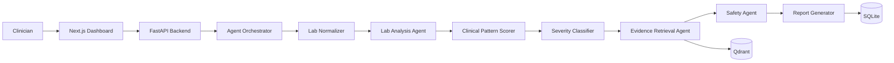
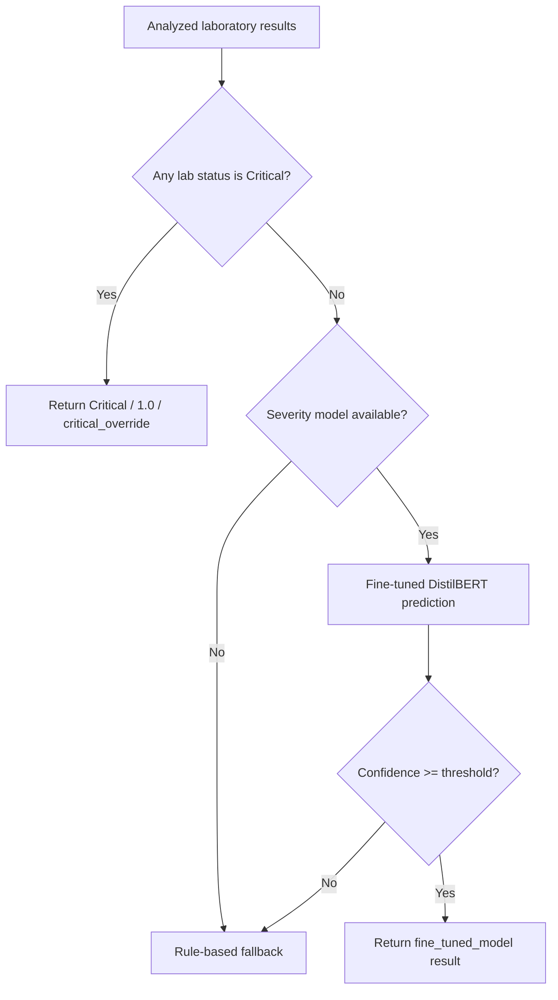
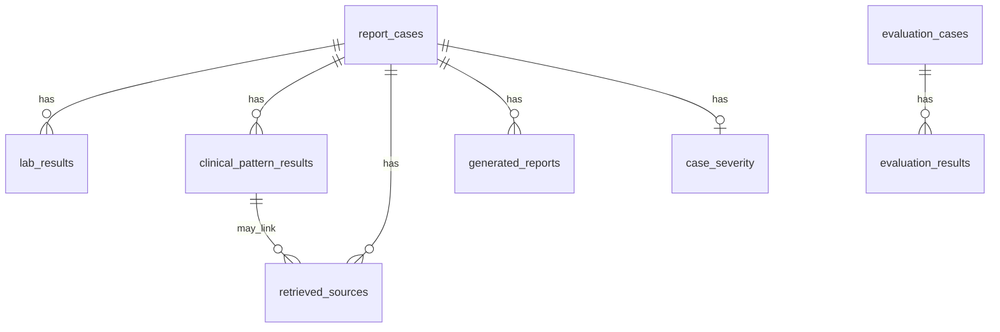

# MedDx Assistant

**MedDx Assistant - AI-Powered Clinical Laboratory Review & Decision Support System**

MedDx Assistant is a clinician-facing capstone project that reviews structured laboratory cases, highlights abnormal findings, ranks clinical review patterns, retrieves supporting medical context, estimates severity, and generates downloadable reports.

**AISPIRE Capstone Project**
**Team:** NextGen
**Team slug:** Group2-Team3

> **Safety notice:** For clinicians only — supports review, not diagnosis or prescribing.

[](#technology-stack)
[](#technology-stack)
[](#technology-stack)
[](#technology-stack)
[](#running-with-docker)
[](#rag-and-evidence-retrieval)
[](#fine-tuned-severity-classifier)
[](#testing-and-quality-gates)
[](#license)

<p align="center">
  
</p>

<p align="center"><em>Existing frontend hero asset used by the MedDx dashboard. A dedicated dashboard screenshot is not currently checked into the repository.</em></p>

**Fast Links:** [Demo](#running-with-docker) · [Architecture](#system-architecture) · [Evaluation](#evaluation-results) · [Setup](#getting-started)

## Table of Contents

- [Why MedDx Exists](#why-meddx-exists)
- [What MedDx Does](#what-meddx-does)
- [Safety by Design](#safety-by-design)
- [Key Features](#key-features)
- [Supported Laboratory Panels](#supported-laboratory-panels)
- [System Architecture](#system-architecture)
- [Severity Decision Flow](#severity-decision-flow)
- [RAG and Evidence Retrieval](#rag-and-evidence-retrieval)
- [Fine-Tuned Severity Classifier](#fine-tuned-severity-classifier)
- [Technology Stack](#technology-stack)
- [Repository Structure](#repository-structure)
- [Getting Started](#getting-started)
- [Environment Configuration](#environment-configuration)
- [Running with Docker](#running-with-docker)
- [Running Locally Without Docker](#running-locally-without-docker)
- [API Overview](#api-overview)
- [Example Clinical Workflow](#example-clinical-workflow)
- [Generated Reports](#generated-reports)
- [Database Design](#database-design)
- [Evaluation Methodology](#evaluation-methodology)
- [Evaluation Results](#evaluation-results)
- [Testing and Quality Gates](#testing-and-quality-gates)
- [Docker and Model Reliability](#docker-and-model-reliability)
- [Observability](#observability)
- [Limitations](#limitations)
- [Future Work](#future-work)
- [Team](#team)
- [Development Workflow](#development-workflow)
- [Contributing](#contributing)
- [License](#license)
- [Acknowledgements](#acknowledgements)
- [Final Safety Notice](#final-safety-notice)

## Why MedDx Exists

Laboratory review is repetitive, detail-heavy work. A clinician often needs to read each value, normalize lab names, compare values against reference ranges, notice abnormal combinations, consider urgency, and cross-reference supporting medical context.

MedDx Assistant brings those review artifacts together in one workflow: abnormal findings, pattern evidence, missing evidence, retrieved knowledge snippets, severity support, and downloadable reports. It is designed to reduce review friction, not to make autonomous clinical decisions.

Clinical judgment remains required because lab values are only one part of care. Reference ranges vary by laboratory, patient context, method, age, sex, timing, and history.

## What MedDx Does

MedDx accepts a structured lab case from the dashboard or API and runs the following workflow:

1. Captures case input: age, sex, selected panel, symptoms, notes, and lab values.
2. Normalizes laboratory names and aliases such as `Hgb`, `CK`, and `TnI`.
3. Normalizes symptoms against configured panel vocabulary.
4. Classifies each lab value as `Normal`, `Low`, `High`, `Critical`, or `Unknown`.
5. Scores clinical review patterns using configured AND/OR rules.
6. Estimates severity as `Routine`, `Urgent`, or `Critical`.
7. Retrieves supporting medical evidence from Qdrant using PubMedBERT embeddings.
8. Sanitizes unsafe or overly definitive clinical language.
9. Generates Markdown, HTML, and PDF reports.
10. Persists cases, lab results, patterns, retrieved source metadata, generated reports, and severity.

MedDx does **not** confirm diagnoses, prescribe medication, recommend treatment plans, or replace clinician judgment.

## Safety by Design

> **Clinical positioning:** MedDx Assistant is a clinician-facing review assistant. It is not a diagnostic, prescribing, or treatment recommendation system.

Safety controls verified in the repository include:

- A mandatory safety notice in dashboard and report responses: **"For clinicians only — supports review, not diagnosis or prescribing."**
- A `SafetyAgent` that rewrites unsafe language such as confirmed diagnosis, treatment plan, prescribe, start medication, and stop medication.
- Cautious phrasing such as "may suggest", "may be consistent with", and "requires clinician review".
- A deterministic critical-value override that prevents a classified critical lab from being downgraded by the model or fallback.
- A confidence threshold for the fine-tuned severity classifier.
- A rule-based fallback when the severity model is unavailable, below threshold, or fails inference.
- Explicit report sections for limitations and final safety notice.

Known safety limitation: the system is evaluated on synthetic/curated cases and simplified educational reference ranges. It has not been clinically validated for autonomous use.

## Key Features

| Feature | Implementation | Output |
|---|---|---|
| Lab normalization | `LabNormalizer` with alias maps and fuzzy symptom handling | Canonical lab names and normalized symptoms |
| Lab analysis | `LabAnalysisAgent` with `data/reference_ranges.json` | `Normal`, `Low`, `High`, `Critical`, `Unknown` |
| Clinical patterns | `ClinicalPatternScorer` using configured AND/OR rules | Ranked top-3 pattern candidates |
| Severity classification | `SeverityClassifierService` with local DistilBERT | `Routine`, `Urgent`, or `Critical` plus confidence/source |
| Critical override | Severity pipeline checks analyzed lab statuses before ML | `Critical / 1.0 / critical_override` |
| Evidence retrieval | PubMedBERT embeddings + Qdrant collection `medical_knowledge` | Source snippets, similarity scores, section metadata |
| Safety sanitization | `SafetyAgent` recursive dashboard sanitization | Cautious clinical language and safety notice |
| Report generation | `ReportGeneratorAgent` + ReportLab | Markdown, HTML, and PDF reports |
| Persistence | SQLAlchemy models with SQLite | Cases, labs, patterns, sources, reports, severity |
| Dashboard | Next.js/React/TypeScript frontend | Case form, results dashboard, report download links |

## Supported Laboratory Panels

Supported panels are loaded from `data/panel_templates.json`.

| Panel | Included Laboratory Tests |
|---|---|
| Complete Blood Count (CBC) | Hemoglobin, WBC, Platelets |
| Diabetic & Glucose Panel | Glucose, HbA1c |
| Renal & Thyroid Panel | Creatinine, TSH |
| Lipids & Inflammation Panel | LDL, HDL, CRP |
| Cardiac Enzymes Panel | Troponin, CPK |
| Electrolytes & Calcium Panel | Sodium, Potassium, Calcium |
| Albumin & Protein Panel | Albumin |

## System Architecture



Layer responsibilities:

| Layer | Responsibility |
|---|---|
| Next.js Dashboard | Collects structured case input and displays analysis results |
| FastAPI Backend | Exposes health, templates, indexing, analysis, case, and report endpoints |
| Agent Orchestrator | Coordinates normalization, analysis, scoring, retrieval, safety, reporting, and persistence |
| Lab Normalizer | Maps aliases and symptom text to canonical project vocabulary |
| Lab Analysis Agent | Applies configured reference and critical thresholds |
| Clinical Pattern Scorer | Scores configured clinical review patterns and ranks the top matches |
| Severity Classifier | Applies critical override, DistilBERT prediction, thresholding, and fallback |
| Evidence Retrieval Agent | Queries Qdrant for relevant medical knowledge chunks |
| Safety Agent | Rewrites unsafe language and enforces the safety notice |
| Report Generator | Creates dashboard JSON plus Markdown, HTML, and PDF reports |
| SQLite | Stores submitted cases, results, report metadata, evaluation data, and severity |
| Qdrant | Stores and searches embedded medical knowledge chunks |

## Severity Decision Flow

The severity pipeline is intentionally ordered so critical laboratory values are never downgraded by model confidence or fallback logic.



Critical override response format:

```json
{
  "label": "Critical",
  "confidence": 1.0,
  "source": "critical_override"
}
```

Verified behavior:

- Urgent non-critical electrolyte case: `{"label": "Urgent", "confidence": 0.8423, "source": "fine_tuned_model"}`
- Critical potassium case: `{"label": "Critical", "confidence": 1.0, "source": "critical_override"}`

## RAG and Evidence Retrieval

MedDx uses retrieval to surface supporting medical context from the repository's curated markdown knowledge base. It does **not** use an LLM to generate clinical conclusions.

Verified retrieval configuration:

| Item | Current value |
|---|---|
| Knowledge directory | `medical_knowledge/` |
| Markdown files indexed | 10 direct markdown files |
| Generated chunks | 107 |
| Qdrant collection | `medical_knowledge` |
| Embedding model | `NeuML/pubmedbert-base-embeddings` |
| Vector size | 768 |
| Distance metric | Cosine |

How retrieval works:

1. `KnowledgeIndexer` chunks markdown files by headings and long sections.
2. `EmbeddingService` embeds chunks with the configured PubMedBERT sentence-transformer model.
3. Chunks are upserted into Qdrant with metadata such as panel, related tests, section title, pattern codes, and status direction.
4. `EvidenceRetrievalAgent` builds a case-specific query from the selected panel, abnormal labs, pattern, aliases, and symptoms.
5. Qdrant returns candidate chunks.
6. The retriever applies panel, test, direction, pattern, lexical, similarity, and relevance filtering.
7. API responses include source snippets, similarity scores, and source metadata.

If Qdrant is unavailable during retrieval, search errors are logged and the service returns an empty source list. A vector-dimension mismatch raises a runtime error because it indicates the collection must be reindexed for the active embedding model.

## Fine-Tuned Severity Classifier

MedDx includes a local fine-tuned DistilBERT classifier for severity support.

| Item | Current value |
|---|---|
| Model architecture | `DistilBertForSequenceClassification` |
| Host path | `models/severity_classifier/` |
| Docker path | `/app/models/severity_classifier` |
| Required artifacts | `config.json`, `model.safetensors`, `tokenizer.json`, `tokenizer_config.json`, `special_tokens_map.json` |
| Labels | `0: Routine`, `1: Urgent`, `2: Critical` |
| Confidence threshold | `SEVERITY_CONFIDENCE_THRESHOLD`, default `0.60` |
| Inference role | Severity prioritization support, not diagnosis |
| Critical override priority | Runs before model prediction and fallback |

The backend loads the model locally with `local_files_only=True`. When the model is missing, unreadable, below threshold, or fails inference, MedDx continues with the rule-based fallback. Docker uses CPU-only PyTorch packaging and intentionally avoids CUDA-heavy packages.

## Technology Stack

| Layer | Technology | Purpose |
|---|---|---|
| Backend API | Python 3.11, FastAPI, Uvicorn | REST API and application startup |
| Data validation | Pydantic | Request and response schemas |
| Persistence | SQLAlchemy, SQLite | Cases, labs, patterns, reports, evaluation rows, severity |
| AI/ML | PyTorch, Transformers, DistilBERT | Local severity classification |
| Embeddings | Sentence Transformers, `NeuML/pubmedbert-base-embeddings` | Biomedical vector embeddings |
| Vector database | Qdrant | Similarity search over medical knowledge chunks |
| Reports | Markdown, HTML, ReportLab `4.4.10` | Downloadable clinical review reports |
| Frontend | Next.js `16.2.10`, React `19.2.4`, TypeScript `5` | Interactive clinical review dashboard |
| UI libraries | Tailwind CSS `4`, Framer Motion `12.42.2`, Lucide React `1.23.0` | Styling, motion, icons |
| Infrastructure | Docker, Docker Compose | Local multi-service deployment |
| Testing | pytest, ESLint, Next build, `compileall` | Quality gates |

## Repository Structure

```text
.
├── app/                         # FastAPI backend, database models, schemas, and services
│   ├── api/                     # API routes
│   ├── db/                      # SQLAlchemy database setup, models, repositories
│   ├── models/                  # Pydantic request/response schemas
│   └── services/                # Orchestrator, lab analysis, severity, RAG, safety, reports
├── data/                        # Lab aliases, panel templates, reference ranges, patterns, synthetic data
├── docs/                        # Supporting architecture, dataset, and model documentation
├── eval/                        # Held-out cases, evaluation runner, results, failure analysis
├── frontend/                    # Next.js dashboard
│   ├── public/assets/           # Existing frontend visual/video assets
│   └── src/                     # App, components, API client, TypeScript types
├── medical_knowledge/           # Curated markdown files indexed into Qdrant
├── ml/                          # Severity classifier training script
├── models/severity_classifier/  # Local fine-tuned DistilBERT artifacts
├── reports/generated_reports/   # Generated Markdown/HTML/PDF report outputs
├── Dockerfile                   # Backend image
├── docker-compose.yml           # Backend, frontend, Qdrant, and indexer services
├── requirements.txt             # Backend/ML dependencies
└── TEAM_CONTRACT.md             # Team roster, workflow, and collaboration agreement
```

Excluded from this overview: `.git`, `.venv`, `node_modules`, build caches, and model checkpoint internals.

## Getting Started

### Prerequisites

- Git
- Docker Desktop or Docker Engine
- Docker Compose
- Optional for local non-Docker development:
  - Python 3.11+
  - Node.js and npm
  - A reachable Qdrant service

### Clone

```bash
git clone https://github.com/capstone-group2-team3/main-repo.git
cd main-repo
```

## Environment Configuration

The Docker Compose file provides the main runtime configuration. `.env.example` is present as a template, but Docker Compose currently overrides several values directly.

| Variable | Service | Required | Default / Current Docker value | Purpose |
|---|---|---:|---|---|
| `DATABASE_URL` | Backend, indexer | Yes | `sqlite:////app/runtime/meddx.db` in Docker; code default `sqlite:///./data/meddx.db` | SQLite database location |
| `QDRANT_URL` | Backend, indexer | Yes | `http://qdrant:6333` in Docker; code default `http://localhost:6333` | Qdrant connection URL |
| `SEVERITY_MODEL_PATH` | Backend, indexer | Yes for model use | `/app/models/severity_classifier` in Docker; code default `models/severity_classifier` | Local severity model directory |
| `SEVERITY_CONFIDENCE_THRESHOLD` | Backend, indexer | No | `0.60` | Minimum confidence required for model output |
| `TRANSFORMERS_OFFLINE` | Backend, indexer | No | `1` | Keeps Transformers offline in Docker |
| `HF_HUB_OFFLINE` | Backend, indexer | No | `1` | Keeps Hugging Face hub offline in Docker |
| `HF_HOME` | Backend, indexer | No | `/app/.cache/huggingface` | Hugging Face cache path |
| `EMBEDDING_MODEL_NAME` | Backend, indexer | Yes for RAG | `NeuML/pubmedbert-base-embeddings` | Embedding model for indexing/retrieval |
| `EMBEDDING_VECTOR_DIMENSION` | Backend, indexer | Yes for RAG | `768` | Expected embedding dimension |
| `EMBEDDING_LOCAL_FILES_ONLY` | Backend, indexer | No | `false` in Docker Compose | Controls local-only loading for embeddings unless offline env vars force local mode |
| `REPORT_TIMEZONE` | Backend reports | No | `Asia/Amman` | Time zone for generated report timestamps |
| `NEXT_PUBLIC_API_BASE_URL` | Frontend | Yes | `http://localhost:8000` | Browser-visible API base URL |
| `NODE_ENV` | Frontend | No | `production` | Frontend runtime mode in Docker |
| `PORT` | Frontend | No | `3000` | Frontend service port |
| `HOSTNAME` | Frontend | No | `0.0.0.0` | Frontend bind address |

No secrets, tokens, or credentials are required by the current local setup.

## Running with Docker

Docker is the recommended path because it starts the backend, frontend, and Qdrant together.

```bash
docker compose build
docker compose up -d
docker compose ps
```

Verified service ports:

| Service | URL |
|---|---|
| Frontend dashboard | http://localhost:3000 |
| Backend API | http://localhost:8000 |
| FastAPI docs | http://localhost:8000/docs |
| Backend health | http://localhost:8000/health |
| Qdrant HTTP API | http://localhost:6333 |

Index or reindex the curated medical knowledge base:

```bash
docker compose run --rm indexer
```

Shut down services:

```bash
docker compose down
```

Avoid `docker compose down -v` unless you intentionally want to delete persistent Docker volumes, including Qdrant storage, generated report volume data, and the SQLite runtime database volume.

## Running Locally Without Docker

Local development is supported, but Qdrant is still required for retrieval if you want RAG results.

Backend:

```bash
python -m venv .venv
. .venv/bin/activate
pip install -r requirements.txt
uvicorn app.main:app --reload
```

Frontend:

```bash
npm --prefix frontend install
npm --prefix frontend run dev
```

If Qdrant is running locally on port `6333`, index medical knowledge through the API:

```bash
curl -X POST http://localhost:8000/index/medical-knowledge
```

If Qdrant or the embedding model is unavailable, evidence retrieval may return empty sources or raise a dimension/model loading error depending on the failure mode.

## API Overview

Authentication is not implemented in the current repository.

| Method | Endpoint | Purpose | Authentication |
|---|---|---|---|
| `GET` | `/health` | Health check | None |
| `GET` | `/templates` | List available panels/templates | None |
| `GET` | `/templates/{panel_name}` | Fetch one panel template by key/display alias | None |
| `POST` | `/index/medical-knowledge` | Index markdown knowledge into Qdrant | None |
| `POST` | `/reports/analyze` | Run the full clinical review pipeline | None |
| `GET` | `/reports/{case_id}/download/markdown` | Download latest Markdown report for a case | None |
| `GET` | `/reports/{case_id}/download/html` | Download latest HTML report for a case | None |
| `GET` | `/reports/{case_id}/download/pdf` | Download latest PDF report for a case | None |
| `GET` | `/reports/{report_id}` | Retrieve generated report metadata/content by report ID | None |
| `GET` | `/cases/{case_id}` | Retrieve saved case metadata | None |

### Example Request

```bash
curl -s -X POST http://localhost:8000/reports/analyze \
  -H "Content-Type: application/json" \
  -d '{
    "selected_panel": "Electrolytes_Calcium_Panel",
    "age": 72,
    "sex": "female",
    "symptoms": ["confusion"],
    "clinical_notes": "Fictional critical electrolyte review.",
    "labs": [
      {"name": "Sodium", "value": 139, "unit": "mEq/L"},
      {"name": "Potassium", "value": 7.4, "unit": "mEq/L"},
      {"name": "Calcium", "value": 9.2, "unit": "mg/dL"}
    ]
  }'
```

### Shortened Response Shape

```json
{
  "report_case_id": 1,
  "lab_results": [
    {
      "test_name": "Potassium",
      "value": 7.4,
      "unit": "mEq/L",
      "status": "Critical",
      "critical_high": 6.5
    }
  ],
  "abnormal_findings": [
    {
      "test": "Potassium",
      "status": "Critical",
      "evidence": "Potassium value 7.4 mEq/L is Critical..."
    }
  ],
  "clinical_patterns": [
    {
      "pattern_code": "electrolyte_imbalance_pattern",
      "pattern": "Abnormal sodium or potassium supporting an electrolyte review pattern."
    }
  ],
  "retrieved_sources": [
    {
      "source_id": "electrolytes_calcium",
      "title": "Electrolytes and Calcium Clinical Review",
      "snippet": "Abnormal Potassium Low or high potassium supports prompt review...",
      "similarity_score": 0.8824043
    }
  ],
  "severity": {
    "label": "Critical",
    "confidence": 1.0,
    "source": "critical_override"
  },
  "report": {
    "markdown_download_url": "/reports/1/download/markdown",
    "html_download_url": "/reports/1/download/html",
    "pdf_download_url": "/reports/1/download/pdf"
  },
  "safety_notice": "For clinicians only — supports review, not diagnosis or prescribing."
}
```

The exact retrieved sources and case/report IDs vary by database state and Qdrant index state.

## Example Clinical Workflow

Fictional case:

```json
{
  "selected_panel": "Electrolytes_Calcium_Panel",
  "age": 72,
  "sex": "female",
  "symptoms": ["confusion"],
  "labs": [
    {"name": "Sodium", "value": 139, "unit": "mEq/L"},
    {"name": "Potassium", "value": 7.4, "unit": "mEq/L"},
    {"name": "Calcium", "value": 9.2, "unit": "mg/dL"}
  ]
}
```

Verified workflow behavior:

| Stage | Output |
|---|---|
| Normalization | Lab names remain Sodium, Potassium, Calcium |
| Lab classification | Sodium `Normal`, Potassium `Critical`, Calcium `Normal` |
| Pattern scoring | Electrolyte-related review pattern can be returned because potassium is abnormal |
| Severity | `Critical / 1.0 / critical_override` |
| Evidence retrieval | Qdrant returns relevant evidence when indexed and reachable; otherwise source lists may be empty |
| Reports | Markdown, HTML, and PDF files are generated with severity and safety sections |

This example is synthetic and does not provide diagnosis, prescribing, or treatment advice.

## Generated Reports

Reports are generated by `ReportGeneratorAgent`.

| Format | Behavior |
|---|---|
| Markdown | Stored under `reports/generated_reports/` and persisted in SQLite |
| HTML | Stored next to Markdown for printable browser review |
| PDF | Rendered with ReportLab and exposed through a download endpoint |

Report sections include:

- Clinical Safety Notice
- Case Overview / Patient Summary
- Review Summary
- Severity Support Alert
- Laboratory Results
- Abnormal Findings
- Clinical Warnings
- Clinical Patterns
- Retrieved Sources
- Missing Required Labs
- Clinical Interpretation Limitations
- Technical Metadata
- Final Safety Notice

Docker stores generated reports in the `meddx_reports` volume mounted at `/app/reports/generated_reports`.

## Database Design

SQLite tables verified from SQLAlchemy models:

| Table | Purpose |
|---|---|
| `report_cases` | Submitted case demographics, panel, symptoms, notes, created timestamp |
| `lab_results` | Per-case lab result, value, unit, status, ranges, evidence |
| `clinical_pattern_results` | Pattern code/name, rank, score, confidence, evidence, missing evidence, warnings |
| `retrieved_sources` | Retrieved source metadata and similarity scores linked to a case/pattern |
| `generated_reports` | Markdown report content, file path, timestamp |
| `knowledge_docs_metadata` | Metadata for indexed medical knowledge documents |
| `evaluation_cases` | Stored evaluation case inputs and expected patterns |
| `evaluation_results` | Evaluation predictions, expected patterns, correctness, latency, run ID |
| `case_severity` | One persisted severity result per report case |



## Evaluation Methodology

The evaluation harness in `eval/run_eval.py` runs the application pipeline against `eval/heldout.jsonl`.

Verified current evaluation setup:

- 57 held-out synthetic cases.
- Cases are separate from the severity training data files in `data/`.
- The run records per-case pattern recall, evidence grounding, abnormal-finding match, safety notice presence, severity correctness, critical recall, and latency.
- `eval/results.json` stores summary and per-case details.
- `eval/failure_cases.md` documents observed failures and likely improvement areas.
- `eval/run_baseline.py` runs a majority-class severity baseline on the same held-out set and primary metric.
- `eval/generate_error_analysis.py` writes grouped error-analysis data to `eval/error_analysis.json`.

Metric definitions:

| Metric | Meaning |
|---|---|
| Top-3 Clinical Pattern Recall | Whether expected patterns appeared in the ranked top-3 patterns |
| Evidence Grounding Rate | Whether matched cases returned retrieved evidence where expected |
| Critical Recall | Fraction of expected critical cases returned as Critical |
| Severity Accuracy | Fraction of cases where predicted severity matched expected severity |
| Average Latency | Mean end-to-end pipeline latency in milliseconds during evaluation |

Evaluation limitations:

- Cases are synthetic and curated, not real patient records.
- Expected severity labels are deterministic project labels, not clinician-adjudicated outcomes.
- Dataset size limits generalization claims.
- First-case latency may include model initialization.
- The held-out severity distribution is imbalanced toward Urgent cases.

## Evaluation Results

Current values are from `eval/results.json` generated at `2026-07-13T00:18:08.884302+00:00`.

| Metric | Result | Interpretation |
|---|---:|---|
| Total held-out cases | 57 | Small synthetic evaluation set |
| Successful cases | 57 | Pipeline completed for every held-out case |
| Top-3 Clinical Pattern Recall | 1.0000 | Strong pattern recall on this held-out set |
| Evidence Grounding Rate | 0.9298 | Retrieved evidence exceeded the project target for most cases |
| Abnormal Findings Match Rate | 1.0000 | Lab classification matched expected abnormal findings |
| Safety Notice Presence Rate | 1.0000 | Safety notice was preserved in evaluated outputs |
| Critical Recall | 1.0000 | Critical recall is protected by deterministic override logic |
| Severity Accuracy | 0.6316 | Main improvement target; several non-critical cases were over/under-prioritized |
| Average Latency | 268.66 ms | Approximate average from the recorded evaluation run |

Honest interpretation:

- Pattern recall is strong on the held-out set.
- Evidence grounding is strong but not perfect.
- Critical recall is protected by deterministic critical-value override.
- Severity accuracy is the main improvement area.
- A majority-class baseline reaches 0.9123 severity accuracy by predicting Urgent for every case, but its Critical recall is 0.0000; that makes it unsafe for the project's highest-risk failure mode.
- The dataset size and synthetic labels limit clinical generalization claims.

Baseline and error-analysis artifacts:

| Artifact | Purpose |
|---|---|
| `eval/baseline_results.json` | Majority-class baseline result on the same held-out set |
| `eval/error_analysis.json` | Grouped failures by panel, reason, and severity source |
| `eval/failure_cases.md` | Human-readable observed failure cases and likely causes |
| `MODEL_CARD.md` | Severity model behavior, metrics, limitations, and safety notes |
| `DATASET_CARD.md` | Dataset purpose, schema, split, limitations, and privacy notes |
| `docs/EXECUTIVE_BRIEFING.md` | Final concise technical and stakeholder briefing |
| `docs/FINAL_SUBMISSION_CHECKLIST.md` | Technical versus human/external submission checklist |

## Testing and Quality Gates

Verified final commands:

```bash
python -m compileall app
.venv/bin/python -m pytest -q
npm --prefix frontend run lint
npm --prefix frontend run build
```

Verified results:

| Gate | Result |
|---|---|
| `python -m compileall app` | Passed |
| `.venv/bin/python -m pytest -q` | 81 passed, 3 warnings |
| `npm --prefix frontend run lint` | Passed |
| `npm --prefix frontend run build` | Passed |
| Docker backend build | Passed |
| Docker health | Backend, frontend, and Qdrant healthy |
| Severity model | `model_available: True` |
| Direct model load | `DistilBertForSequenceClassification` |
| Urgent API regression | `Urgent / 0.8423 / fine_tuned_model` |
| Critical API regression | `Critical / 1.0 / critical_override` |
| CUDA-heavy packages | Not present in backend package scan |

No code coverage percentage is claimed because coverage was not measured.

## Docker and Model Reliability

Important reliability decisions verified in the current Docker setup:

- The severity model is mounted read-only from `./models/severity_classifier` to `/app/models/severity_classifier`.
- `SEVERITY_MODEL_PATH` points to `/app/models/severity_classifier`.
- Runtime SQLite data is stored under `/app/runtime`.
- Static application configuration remains under `/app/data`.
- Do **not** mount a Docker volume over `/app/data`; doing so can hide rebuilt reference configuration such as `data/reference_ranges.json`.
- Backend Docker packaging uses the CPU PyTorch index through `PIP_EXTRA_INDEX_URL=https://download.pytorch.org/whl/cpu`.
- CUDA-heavy packages such as CUDA toolkit, cuDNN, cuBLAS, NCCL, and Triton GPU stack were intentionally avoided in validation.

## Observability

Currently implemented:

- `GET /health` returns `{"status": "ok"}`.
- `GET /metrics` returns Prometheus-compatible text metrics.
- Request middleware generates or reuses a safe `X-Request-ID`, returns it in the response header, and logs one JSON line per request.
- Request logs contain safe operational fields only: timestamp, level, request ID, method, endpoint, status code, and latency.
- Docker Compose health checks call backend and frontend endpoints and check Qdrant port availability.
- Severity model loading/fallback paths log warnings.
- Evidence retrieval logs Qdrant collection/search failures.
- Evaluation output records per-case latency in `eval/results.json`.

Implemented metric families include:

- `meddx_http_requests_total`
- `meddx_http_request_errors_total`
- `meddx_http_request_latency_seconds_count`
- `meddx_http_request_latency_seconds_sum`
- `meddx_analyzed_cases_total`
- `meddx_critical_overrides_total`
- `meddx_retrieved_evidence_chunks_total`
- `meddx_severity_predictions_total`

Not currently implemented:

- Centralized latency/error dashboards.
- Authentication or authorization.

## Limitations

- Educational/decision-support prototype only.
- Not clinically validated for autonomous use.
- Does not diagnose, prescribe, recommend treatment plans, or replace clinician judgment.
- Evaluation uses 57 synthetic held-out cases.
- Severity accuracy is currently `0.6316`, making model calibration a major improvement target.
- Severity labels are based on project expectations and synthetic/rule-derived data, not real clinical outcomes.
- Reference ranges are simplified and may differ by laboratory, method, age, sex, and clinical context.
- RAG knowledge scope is limited to curated repository markdown files.
- Local deployment assumes Docker and local model artifacts.
- Embedding/RAG behavior depends on Qdrant being indexed with the configured 768-dimensional model.

## Future Work

- Rebalance severity training data and reduce non-critical severity misclassification.
- Calibrate severity confidence thresholds against a larger held-out set.
- Expand held-out evaluation with more cases and panel combinations.
- Expand curated medical evidence and verify retrieval by laboratory panel.
- Add retrieval-quality evaluation by source section and lab direction.
- Improve observability with structured logs, request IDs, and metrics.
- Add authentication and role-based access if the project moves beyond local demo use.
- Add clinician usability testing with clearly non-diagnostic evaluation criteria.

## Team

Team details are verified from `TEAM_CONTRACT.md`.

| Member | GitHub | Main Contributions / Strength Areas |
|---|---|---|
| Hussam Rabaa | [@Hussamraba](https://github.com/Hussamraba) | Backend structure, database design, AI/RAG/NLP, Docker/deployment planning, GitHub workflow, frontend support |
| Eng Deema | [@DeemaAhmad100](https://github.com/DeemaAhmad100) | Python, descriptive analytics, database work, AI/ML evaluation, fine-tuning, RAG/agentic AI, product direction |
| Rama Mathloni | [@ramamathloni-dotcom](https://github.com/ramamathloni-dotcom) | Machine learning, NLP/agentic pipelines, data engineering, semantic search/vector databases, documentation/debugging |
| Ali Alquraan | [@alialquran](https://github.com/alialquran) | Machine learning, NLP, Docker, SQL, vector databases, semantic search, RAG, API support |

## Development Workflow

Verified from `TEAM_CONTRACT.md`:

- Work is tracked in GitHub Projects.
- Board columns: Backlog, In progress, In review, Done.
- Tasks should have an owner before moving to In progress.
- Graded project work should go through a feature branch and Pull Request.
- PRs should receive teammate review before merging.
- Team members are expected to avoid siloed work and be able to explain the full project by Demo Day.

Repository URL: https://github.com/capstone-group2-team3/main-repo

## Contributing

Suggested contribution flow:

1. Open or select an issue/task.
2. Create a feature branch.
3. Make a focused change.
4. Add or update tests.
5. Preserve clinical safety controls.
6. Run quality gates.
7. Open a Pull Request for review.

Contributions must not remove or weaken:

- The mandatory safety notice.
- Clinician-only positioning.
- Critical-value override.
- Rule-based fallback.
- Severity confidence threshold.
- Evidence grounding.
- Safety language sanitization.

## License

This repository includes an MIT License in [`LICENSE`](LICENSE).

## Acknowledgements

MedDx Assistant was built as an AISPIRE Capstone project by Team NextGen.

The medical knowledge used by the application is curated into repository markdown files under `medical_knowledge/`. The project does not include real patient data.

## Final Safety Notice

> **For clinicians only — supports review, not diagnosis or prescribing.**
